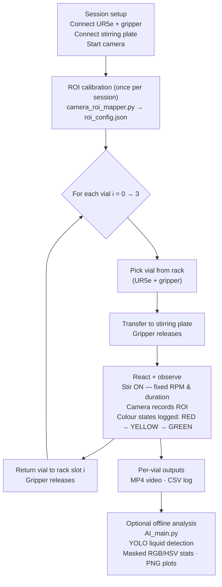

# Robo-Auto-Chem: Reproducible Robot-Assisted Colour-Change Reaction & Video-to-Data Pipeline

**Course / Module:** CHEM504 Robotics and Automation in Chemistry — University of Liverpool · Demo Day 2026  
**Team / Authors:** Group B *(placeholder — add names before submission)*  
**Repository:** [B-313/Robo-Auto-Chem](https://github.com/B-313/Robo-Auto-Chem)

---

## Abstract

Robo-Auto-Chem is a lab automation pipeline that uses a **UR5e collaborative robot** to handle vials through a traffic-light colour-change reaction while simultaneously capturing structured, traceable data for post-run analysis. Each vial follows an identical physical sequence (pick → stir-plate → observe → return), with a fixed camera region-of-interest (ROI) ensuring measurement consistency across all runs. Per-vial outputs—MP4 video and a timestamped CSV—provide an auditable evidence trail linking every observation to a specific script version and parameter set. An optional offline stage applies a YOLO-based liquid localisation model to the recorded videos, computing masked RGB/HSV colour statistics and saving comparison plots. The result is a reproducible, version-controlled protocol that converts a physical chemistry demonstration into inspectable, comparable datasets.

---

## System Overview

| Component | Role | Key script |
|---|---|---|
| **UR5e + Robotiq gripper** | Vial pick-and-place (rack ↔ stirring plate) | `ur5_main.py` |
| **IKA stirring plate** | Fixed-RPM stirring for set duration (serial/USB) | `archived/stirring_plate.py` |
| **USB camera + ROI calibration** | Consistent per-session observation window | `archived/camera_roi_mapper.py` |
| **HSV colour detection** | Real-time colour-state logging within ROI | `archived/roi_color_detection_module.py` |
| **YOLO offline analysis** | Post-run liquid detection & masked colour stats | `AI_main.py` |

Fixed parameters (set in `ur5_main.py`): `RECORD_SECONDS = 190`, `STIR_SECONDS = 20`, `STIR_RPM = 1500`, `NUM_VIALS = 4`.

---

## Implemented Workflow



---

## Data Artifacts

| Artifact | Content | Produced by |
|---|---|---|
| **MP4** | Full video recording with ROI bounding-box overlay; produced during the live robot run | `ur5_main.py` — `basic_recorder()` |
| **CSV** (per vial) | `frame`, `time_s`, `r_mean`, `g_mean`, `b_mean`, `h_mean`, `s_mean`, `v_mean`; produced in the **offline analysis step** from the recorded MP4s | `AI_main.py` / `AI_highlight_main.py` |
| **PNG plot** (per vial) | RGB channel means vs. time showing RED → YELLOW → GREEN transition; produced in the **offline analysis step** | `AI_main.py` — `save_plot()` |
| **Combined CSV** | All vials concatenated for cross-vial comparison; produced in the **offline analysis step** | `AI_main.py` — `all_videos_combined_results.csv` |
| **roi_config.json** | Saved ROI coordinates for reproducible camera framing; produced during calibration | `archived/camera_roi_mapper.py` |

---

## Methods

**ROI Calibration** (`archived/camera_roi_mapper.py`): An interactive tool captures one camera frame and asks the operator to drag a bounding box around the vial. Coordinates are saved to `roi_config.json` and reused throughout the session, ensuring the same pixels are analysed for every vial.

**HSV / ROI Colour Detection** (`archived/roi_color_detection_module.py`): Within the saved ROI, frames are converted to HSV colour space and thresholded to classify pixels as red, yellow, or green. The dominant colour state is logged with a timestamp, mapping chemical transitions (RED = unreacted, YELLOW = induction, GREEN = complete).

**YOLO Offline Analysis** (`AI_main.py`): A trained YOLO model detects the liquid bounding box on the first frame of each recording. An HSV mask refines the liquid region, which is then reused across all subsequent frames (sampled every `FRAME_STEP = 15` frames). Per-frame mean RGB and HSV statistics are written to CSV and plotted for comparison across vials.

---

## Reproducibility & Traceability

| Principle | How it is implemented |
|---|---|
| **Fixed parameters** | `STIR_RPM`, `STIR_SECONDS`, `RECORD_SECONDS`, `NUM_VIALS` defined at top of `ur5_main.py` |
| **Per-vial output bundle** | MP4 + CSV saved with vial index in filename |
| **Consistent measurement** | ROI locked per session via `roi_config.json` |
| **Safety interlock** | Stirrer always stopped before robot picks vial (`stir_then_stop()` before `move_joint_list`) |
| **Version-controlled scripts** | All code maintained in Git; dataset can be tied to exact commit |
| **Fault isolation** | Single-vial failures do not abort the run; loop continues for remaining vials |

---

## How to Reproduce

> Requires: UR5e + Robotiq gripper on network, IKA stirring plate on serial, USB camera, Python environment with dependencies from `requirements.txt`, and a trained YOLO model (`best.pt`) for offline analysis.

```
# 1. Install dependencies
pip install -r requirements.txt

# 2. Calibrate camera ROI (once per session)
python3 archived/camera_roi_mapper.py
#    → saves roi_config.json

# 3. Run the full experiment (4 vials)
python3 ur5_main.py
#    → saves MP4 videos to VIDEO_DIR

# 4. (Optional) Run offline YOLO analysis
python3 AI_main.py
#    → saves CSV + PNG plots to batch_results/
```

Edit the `CONFIG` block at the top of `ur5_main.py` to match your hardware addresses and desired parameters before running.

---

## Repository Pointers

| File | Description |
|---|---|
| [`ur5_main.py`](../ur5_main.py) | Main experiment routine — robot, stirrer, camera, vial loop |
| [`archived/camera_roi_mapper.py`](../archived/camera_roi_mapper.py) | One-time interactive ROI calibration |
| [`archived/roi_color_detection_module.py`](../archived/roi_color_detection_module.py) | HSV colour detection within ROI |
| [`archived/stirring_plate.py`](../archived/stirring_plate.py) | IKA stirring plate serial driver |
| [`AI_main.py`](../AI_main.py) | Batch YOLO + masked-colour offline analysis |
| [`AI_highlight_main.py`](../AI_highlight_main.py) | ROI-based colour analysis (manual ROI selection) |
| [`notes/demo_insights.md`](../notes/demo_insights.md) | Workflow diagrams, CSV data mapping, run order |
| [`notes/lab_notes.md`](../notes/lab_notes.md) | Reagent recipes used in video demonstrations |
