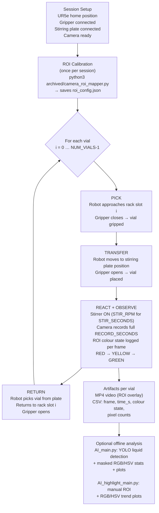

# Robo-Auto-Chem: Reproducible Robot-Assisted Colour-Change Reaction with Video-to-Data Pipeline

**Module:** CHEM504 Robotics & Automation in Chemistry — University of Liverpool  
**Event:** Demo Day 2026  
**Repository:** [B-313/Robo-Auto-Chem](https://github.com/B-313/Robo-Auto-Chem)  
**Authors:** *(Team B-313 — placeholders: Author A, Author B, Author C, Author D)*

---

## Abstract

Robo-Auto-Chem automates a "traffic light" colour-change reaction (RED → YELLOW → GREEN) using a **UR5e collaborative robot** coupled with a **Robotiq gripper**, an **IKA stirring plate**, and a **USB camera**, eliminating operator timing variability across replicate vials. A one-time **ROI calibration step** (per session) fixes the camera observation window, ensuring that identical pixel regions are analysed for every vial. Each vial run produces a pair of **traceable artifacts** — an MP4 video recording and a timestamped CSV of colour statistics — that support post-run comparison and reproducibility assessment. An optional offline pipeline (`AI_main.py`) applies a trained **YOLO model** to localise the liquid region automatically and compute masked RGB/HSV channel statistics, yielding per-vial trend plots. All methods are version-controlled in Git, so the exact procedure that generated any dataset is fully inspectable and repeatable.

---

## System Overview

| Component | Role |
|---|---|
| UR5e + Robotiq gripper | Repeatable vial pick-and-place: rack → stirring plate → rack |
| IKA stirring plate (`archived/stirring_plate.py`) | Fixed-parameter reaction control (RPM, stir duration) |
| USB camera + ROI calibration (`archived/camera_roi_mapper.py`) | Consistent per-session observation window; saves `roi_config.json` |
| ROI/HSV colour detection (`archived/roi_color_detection_module.py`) | Real-time colour-state classification (RED / YELLOW / GREEN) |
| MP4 recording (`demo.py` → `basic_recorder`) | Per-vial video evidence |
| CSV logging | Timestamped frame-by-frame colour statistics |
| Offline YOLO analysis (`AI_main.py`) | Post-run liquid localisation + masked colour-channel quantification |
| Offline ROI highlight analysis (`AI_highlight_main.py`) | Alternative: manual ROI selection on recorded video → RGB/HSV plots |

---

## Implemented Workflow



> **Fixed session parameters (defined in `demo.py`):**
> `STIR_RPM = 1500`, `STIR_SECONDS = 60`, `RECORD_SECONDS = 180`, `NUM_VIALS = 4`

---

## Data Artifacts

| Artifact | Produced by | Contents |
|---|---|---|
| `vial_<n>.mp4` | `demo.py` → `basic_recorder()` | Raw video of reaction; optional ROI box overlay |
| `vial_<n>_results.csv` | `AI_highlight_main.py` → `analyse_video()` | Columns: `video_name`, `frame`, `time_s`, `r_mean`, `g_mean`, `b_mean`, `h_mean`, `s_mean`, `v_mean` |
| `all_videos_combined_results.csv` | `AI_highlight_main.py` batch run | Concatenated per-vial CSVs for cross-vial comparison |
| `<stem>_results_plot.png` | `AI_highlight_main.py` → `save_plot()` | RGB channel means vs. time (300 dpi PNG) |
| `<stem>_roi_preview.jpg` / `_roi_crop.jpg` | `AI_highlight_main.py` → `save_roi_preview()` | ROI bounding box overlay + cropped region (QC reference) |
| YOLO CSV + mask preview | `AI_main.py` | Masked colour stats per frame; YOLO bounding-box previews |

---

## Methods Summary

### ROI Calibration
`archived/camera_roi_mapper.py` opens the live camera, displays a single frame, and lets the operator draw a bounding box over the vial using `cv2.selectROI`. The coordinates are written to `roi_config.json` as `{x1, y1, x2, y2, width, height}` and reused by the analysis scripts — ensuring all pixel measurements refer to the same spatial region throughout the session.

### ROI/HSV Colour Detection
`archived/roi_color_detection_module.py` loads the saved ROI, crops each frame to that region, and classifies the dominant colour (RED / YELLOW / GREEN) using HSV thresholds (`archived/color_detection_module.py`). A minimum-pixel threshold (`min_pixels = 800`, empirically set to suppress noise on typical vial-sized ROIs) filters out spurious classifications on low-signal frames.

### Optional YOLO Analysis (`AI_main.py`)
A custom-trained YOLO model (`best.pt`) detects the liquid bounding box in the first frame; HSV morphological refinement then produces a tight liquid mask. Per-frame RGB/HSV statistics computed on this mask are saved to CSV and plotted. A lower-dependency alternative, `AI_highlight_main.py`, skips YOLO and instead asks the operator to draw an ROI on the recorded video, then extracts the same statistics.

---

## Reproducibility & Traceability

| Principle | Implementation |
|---|---|
| **Repeatable execution** | Identical joint-trajectory waypoints per vial slot; same RPM, stir time, and record duration every run |
| **Consistent measurement** | ROI locked from `roi_config.json`; same pixel region analysed across all vials |
| **Per-vial evidence bundle** | One MP4 + one CSV per vial; filenames encode vial index |
| **Safety interlock** | Stirrer always stops before robot approaches plate (`stir_then_stop` blocks until `STIR_SECONDS` elapsed) |
| **Version-controlled methods** | All scripts in Git; exact procedure tied to commit SHA |
| **Auditable parameters** | `STIR_RPM`, `STIR_SECONDS`, `RECORD_SECONDS`, `NUM_VIALS` declared as named constants at top of each routine file |

---

## How to Reproduce

```bash
# 1. Install dependencies
pip install numpy opencv-python Pillow requests ur-rtde pyserial pandas matplotlib ultralytics

# 2. Activate environment (adjust path to your Conda env)
conda activate /home/robot/anaconda3/envs/ur5

# 3. Calibrate ROI (once per physical setup / camera position change)
python3 archived/camera_roi_mapper.py
# → draws a live frame; operator selects vial region → saves roi_config.json

# 4. Run the automated experiment (4 vials)
python3 demo.py
# → picks, transfers, stirs, records, returns each vial
# → writes MP4 files to VIDEO_DIR

# 5. (Alternative manual / step-by-step run)
python3 manual_move.py

# 6. Offline colour-trend analysis (ROI-based, no model required)
python3 AI_highlight_main.py
# → reads MP4s from group_B_videos/, writes CSVs + PNGs to batch_results/

# 7. (Optional) YOLO-based liquid analysis (requires best.pt model file)
python3 AI_main.py
# → YOLO detects liquid region; exports masked colour stats + plots
```

---

## Key Repository Pointers

| Resource | Path |
|---|---|
| Canonical demo routine | [`demo.py`](../demo.py) |
| Manual / step-by-step routine | [`manual_move.py`](../manual_move.py) |
| ROI calibration tool | [`archived/camera_roi_mapper.py`](../archived/camera_roi_mapper.py) |
| ROI colour detection module | [`archived/roi_color_detection_module.py`](../archived/roi_color_detection_module.py) |
| Stirring plate driver (IKA) | [`archived/stirring_plate.py`](../archived/stirring_plate.py) |
| Offline ROI analysis script | [`AI_highlight_main.py`](../AI_highlight_main.py) |
| Offline YOLO analysis script | [`AI_main.py`](../AI_main.py) |
| UR5e utilities | [`utils/UR_Functions.py`](../utils/UR_Functions.py) |
| Demo insights & workflow notes | [`notes/demo_insights.md`](../notes/demo_insights.md) |
| Lab notes & reagent recipes | [`notes/lab_notes.md`](../notes/lab_notes.md) |
| Project README | [`README.md`](../README.md) |
