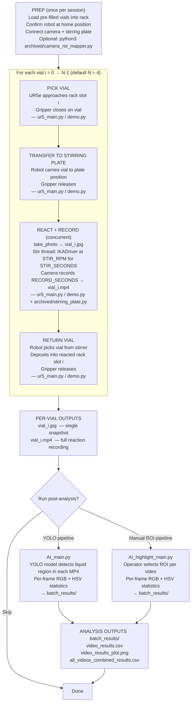

# Robo-Auto-Chem — Implemented Digital Workflow

This document describes the **current, implemented** end-to-end pipeline for the
Robo-Auto-Chem traffic-light colour-change experiment.
Every step maps to a script or file that exists in this repository.

---

## Workflow Overview



---

## Step-by-step Description

### 1 — Preparation (once per session)

| Action | File |
|---|---|
| Manually load pre-filled vials into the rack | — |
| Confirm UR5e is at home position | [`ur5_main.py`](../ur5_main.py) · [`demo.py`](../demo.py) |
| Connect IKA stirring plate over serial | [`archived/stirring_plate.py`](../archived/stirring_plate.py) |
| *(Optional)* Run ROI calibration to save `roi_config.json` | [`archived/camera_roi_mapper.py`](../archived/camera_roi_mapper.py) |

> **ROI calibration** is a one-time interactive step: the tool opens a live camera
> frame, the operator draws a rectangle around the vial, and the coordinates are
> persisted to `roi_config.json` for use in colour-detection helpers.

---

### 2 — Per-vial loop (`run_vial` function)

The main entry point is `main()` in [`ur5_main.py`](../ur5_main.py) (or
[`demo.py`](../demo.py) for the demonstration routine). It iterates over
`range(NUM_VIALS)` and calls `run_vial(i, robot, gripper, plate)` for each index.

#### 2a — Pick vial

The UR5e moves through three waypoints for rack slot `i`:

```
unreacted_approach_high[i]  →  unreacted_insert[i]  →  gripper.close()
```

Waypoints are hard-coded joint-angle lists in the run script.
Robot control is provided by [`utils/UR_Functions.py`](../utils/UR_Functions.py)
(`URfunctions.move_joint_list`).

#### 2b — Transfer to stirring plate

```
unreacted_approach_low[i]  →  unreacted_approach_high[i]
→  stirring_position_above  →  stirring_position_on  →  gripper.open()
```

#### 2c — React and record (concurrent)

Two actions run concurrently using Python's `threading.Thread`:

| Thread | Action | Output |
|---|---|---|
| Main thread | Camera records `RECORD_SECONDS` via OpenCV | `vial_i.mp4` |
| Background thread | IKA plate stirs at `STIR_RPM` for `STIR_SECONDS`, then stops | — |

A single snapshot is also saved before recording starts (`take_photo` → `vial_i.jpg`).

**Fixed parameters** (defined as constants at the top of the run script):

| Constant | Default value in `ur5_main.py` |
|---|---|
| `STIR_RPM` | 1500 RPM |
| `STIR_SECONDS` | 20 s |
| `RECORD_SECONDS` | 190 s |
| `NUM_VIALS` | 4 |

The stirring plate driver (`IKADriver`) lives in
[`archived/stirring_plate.py`](../archived/stirring_plate.py).

#### 2d — Return vial

```
home_position  →  exhausted_approach_high[i]  →  exhausted_approach_low[i]
→  exhausted_insert[i]  →  gripper.open()
```

The vial is deposited into a separate "reacted / exhausted" rack position, keeping
unreacted and reacted vials physically separated.

---

### 3 — Per-vial outputs

After each call to `run_vial`, the output directory contains:

```
group_B_videos/
├── vial_1.jpg        ← snapshot taken before stirring
├── vial_1.mp4        ← full reaction recording
├── vial_2.jpg
├── vial_2.mp4
└── ...
```

*(Exact filenames depend on the prefix constants in the run script.)*

---

### 4 — Optional post-run analysis

Two independent analysis scripts can be run after the experiment:

#### `AI_main.py` — YOLO-based liquid detection

[`AI_main.py`](../AI_main.py) reads every `.mp4` in the configured video folder
and, for each video:

1. Uses a trained YOLO model (`best.pt`) to detect the liquid bounding box in the
   first frame.
2. Refines that region with an HSV mask.
3. Saves detection preview images (`_detected_liquid_box.jpg`, `_overlay.jpg`,
   `_mask.jpg`, `_tight_box.jpg`).
4. Steps through every *N*-th frame (`FRAME_STEP = 15`) and records
   per-frame R/G/B and H/S/V mean values for the masked liquid region.
5. Writes per-video CSV + PNG plot and a combined CSV across all videos.

**Outputs** → `batch_results/`

#### `AI_highlight_main.py` — Manual-ROI analysis

[`AI_highlight_main.py`](../AI_highlight_main.py) is a lighter alternative that
skips YOLO: the operator draws an ROI rectangle on the first frame of each video,
and the script computes the same per-frame colour statistics.

**Outputs** → `batch_results/`

---

## Key files at a glance

| File | Role |
|---|---|
| [`ur5_main.py`](../ur5_main.py) | Primary run script (pick/place/stir/record loop, exhausted rack) |
| [`demo.py`](../demo.py) | Demonstration variant (simplified rack return) |
| [`manual_move.py`](../manual_move.py) | Manual joint-move tool for calibration / debugging |
| [`utils/UR_Functions.py`](../utils/UR_Functions.py) | UR5e RTDE robot control wrapper |
| [`archived/stirring_plate.py`](../archived/stirring_plate.py) | IKA hotplate/stirrer serial driver (`IKADriver`) |
| [`archived/camera_roi_mapper.py`](../archived/camera_roi_mapper.py) | Interactive ROI calibration tool → `roi_config.json` |
| [`archived/roi_color_detection_module.py`](../archived/roi_color_detection_module.py) | HSV colour detection within a saved ROI |
| [`AI_main.py`](../AI_main.py) | YOLO-based post-run video analysis pipeline |
| [`AI_highlight_main.py`](../AI_highlight_main.py) | Manual-ROI post-run video analysis pipeline |
| [`notes/demo_insights.md`](../notes/demo_insights.md) | Lab notes: chemistry context, parameters, run order |
| [`notes/lab_notes.md`](../notes/lab_notes.md) | Reaction recipes used across sessions |

---

## Traceability summary

| Principle | How it is implemented |
|---|---|
| **Reproducibility** | Fixed RPM, stir time, and record duration constants per script; version-controlled waypoints |
| **Per-run artefacts** | Each vial produces a `.jpg` snapshot + `.mp4` recording tied to its index and batch name |
| **Post-run auditability** | `AI_main.py` / `AI_highlight_main.py` write timestamped CSVs linking video filename → per-frame colour statistics |
| **Safety interlock** | Stirrer is always stopped (background thread completes) before the robot re-enters the stirring-plate zone |
| **Version control** | All run scripts, waypoints, and this documentation are tracked in Git |
