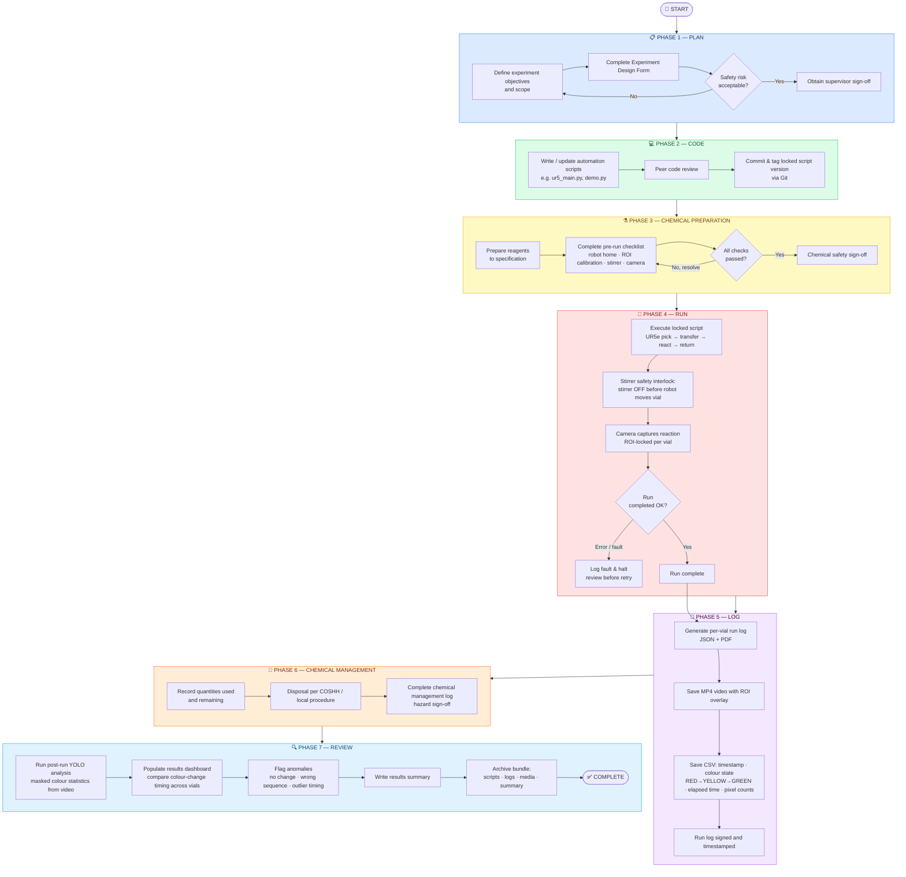

# Digital Workflow — Robo-Auto-Chem

This document describes the end-to-end **digital workflow** used to plan, execute, log, and review a Robo-Auto-Chem run. The workflow is divided into seven phases, each producing defined artefacts that collectively form an audit trail traceable from experimental intent to final data output.

## Design Principles

| Principle | How it is implemented in this repo |
|---|---|
| **Single source of truth** | All run parameters (`STIR_RPM`, `STIR_SECONDS`, `NUM_VIALS`, ROI bounds) are defined in one location per script and logged at run time |
| **Safety-first** | Stirrer is always switched OFF before the UR5e moves a vial (hardcoded safety interlock in [`ur5_main.py`](../ur5_main.py) and [`demo.py`](../demo.py)) |
| **Traceability** | Every vial produces a timestamped MP4 and CSV; run logs capture script version, parameters, and outcomes |
| **Version control** | Scripts are committed and tagged in Git before execution; deprecated routines are preserved in [`archived/`](../archived/) |
| **Reproducibility** | Fixed RPM, stir duration, and ROI coordinates per session; ROI calibration saved to `roi_config.json` |
| **Collaboration** | Shared notes and insights documented in [`notes/`](../notes/) |

---

## 7-Phase Flowchart

The flowchart below renders on GitHub via Mermaid. A standalone copy is also available in [`docs/digital_workflow_flowchart.md`](digital_workflow_flowchart.md).

---

## Phase Descriptions

### Phase 1 — PLAN
Experimental intent is defined and formally approved before any code is written or chemicals are prepared. Artefacts: **experiment design form**, safety assessment, supervisor sign-off.

### Phase 2 — CODE
Automation scripts are written or updated and reviewed. The exact script version used for a run is committed and tagged in Git, providing a permanent reference for the run record. Key scripts: [`ur5_main.py`](../ur5_main.py), [`demo.py`](../demo.py), [`AI_main.py`](../AI_main.py), [`manual_move.py`](../manual_move.py). Deprecated/previous routines are archived in [`archived/`](../archived/).

### Phase 3 — CHEMICAL PREPARATION
Reagents are prepared to specification. A pre-run checklist confirms: robot is at home position, ROI calibration is complete (`roi_config.json` present), stirring plate is connected, and camera feed is active. A chemical safety sign-off is obtained before proceeding.

### Phase 4 — RUN
The locked script is executed. The UR5e performs: pick vial from rack → transfer to stirring plate → react and observe → return to rack, for each of the `NUM_VIALS` vials. A **safety interlock** ensures the stirrer is switched OFF before every robot vial movement. Faults are logged and execution is halted for review before any retry.

### Phase 5 — LOG
Per-vial output is collected automatically:
- **Run log** (JSON/PDF): script version, run parameters, timestamps, outcomes
- **MP4 video** with ROI overlay (output path configured in each routine script)
- **CSV**: timestamp, colour state (`RED` / `YELLOW` / `GREEN`), elapsed time, pixel counts

See [`notes/demo_insights.md`](../notes/demo_insights.md) for a description of what the CSV colour transitions map to chemically.

### Phase 6 — CHEMICAL MANAGEMENT
Quantities of reagents used and remaining are recorded. Disposal follows COSHH and local safety procedures. A chemical management log and hazard sign-off are completed.

### Phase 7 — REVIEW
Post-run analysis is performed using the YOLO-based pipeline ([`AI_main.py`](../AI_main.py), [`AI_highlight_main.py`](../AI_highlight_main.py)) to compute masked colour statistics from recorded video. Results are compared across vials on a dashboard; anomalies (no colour change, wrong sequence, outlier timing) are flagged. A results summary and complete archive bundle (scripts, logs, media) close the run record.

---

## Artefact Summary

| Phase | Key Artefacts |
|---|---|
| PLAN | Experiment design form, safety assessment, supervisor sign-off |
| CODE | Version-controlled scripts, locked script commit/tag (Git) |
| CHEMICAL PREPARATION | Pre-run checklist, chemical safety sign-off |
| RUN | Timestamped run record, fault log (if applicable) |
| LOG | Run log (JSON/PDF), MP4 video (ROI overlay), CSV (colour transitions) |
| CHEMICAL MANAGEMENT | Chemical management log, COSHH disposal record |
| REVIEW | YOLO analysis output, results dashboard, results summary, archive bundle |

---

*See also:* [`docs/linkedin_post_academic.md`](linkedin_post_academic.md) · [`notes/demo_insights.md`](../notes/demo_insights.md)
