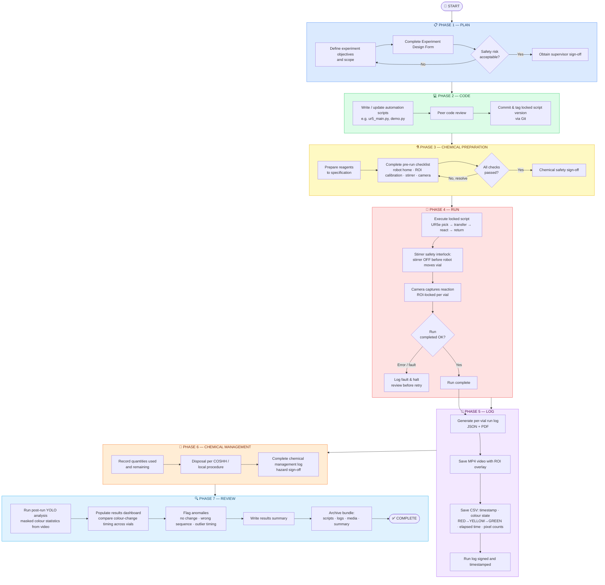

# Digital Workflow Flowchart — Robo-Auto-Chem (7-Phase)

This Mermaid flowchart represents the end-to-end digital workflow used for the CHEM504 Robo-Auto-Chem demonstration. Each phase produces defined artefacts that form the audit trail for a run.

## Artefact Summary

| Phase | Key Artefacts |
|---|---|
| PLAN | Experiment design form, safety assessment, supervisor sign-off |
| CODE | Version-controlled scripts, locked script commit/tag (Git) |
| CHEMICAL PREPARATION | Pre-run checklist, chemical safety sign-off |
| RUN | Timestamped run record, fault log (if applicable) |
| LOG | Run log (JSON/PDF), MP4 video (ROI overlay), CSV (colour transitions) |
| CHEMICAL MANAGEMENT | Chemical management log, COSHH disposal record |
| REVIEW | YOLO analysis output, results dashboard, results summary, archive bundle |
