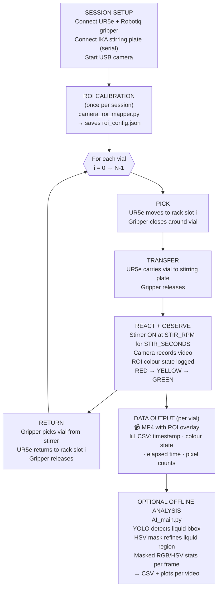

# Robo-Auto-Chem — Digital Poster

**Automated End-to-End Chemistry Pipeline · UR5e + IKA Stirring Plate + Computer Vision**

University of Liverpool · CHEM504 Robotics and Automation in Chemistry

---

## Problem

Manually running colour-change reactions (e.g. the *traffic-light / red-light* oscillating reaction) introduces **operator variability**, makes results hard to compare across vials, and produces no machine-readable record of what happened.

**Goal:** replace manual vial handling and visual observation with a repeatable robotic routine that captures structured, timestamped evidence for every run.

---

## System Overview

```
┌────────────────────────────────────────────────────────────┐
│                     ROBO-AUTO-CHEM                         │
│                                                            │
│  UR5e robot + Robotiq gripper                              │
│      ↓  picks / places vials                               │
│  IKA stirring plate                                        │
│      ↓  stirs at fixed RPM for fixed duration              │
│  USB camera + ROI calibration                              │
│      ↓  records video; detects colour per frame            │
│  CSV logger + MP4 writer                                   │
│      ↓  per-vial timestamped evidence files                │
│  (Optional) YOLO analysis pipeline                         │
│      ↓  offline liquid detection + masked colour stats     │
└────────────────────────────────────────────────────────────┘
```

---

## Workflow



---

## Key Components

| Component | Role | Key file(s) |
|---|---|---|
| **UR5e robot** | 6-DOF arm; picks and places vials using joint-space waypoints | `demo.py`, `utils/UR_Functions.py` |
| **Robotiq gripper** | Opens/closes to grip and release vials | `demo.py` (`gripper.move(...)`) |
| **IKA stirring plate** | Serial-controlled; sets RPM, starts/stops stir | `stirring_plate.py` (IKADriver) |
| **USB camera + ROI** | Records video; ROI restricts analysis to vial region | `demo.py` (`basic_recorder`), `archived/camera_roi_mapper.py` |
| **Colour logger** | HSV detection assigns colour state per frame; writes CSV | `archived/roi_color_detection_module.py`, `archived/color_detection_module.py` |
| **YOLO analysis** | Detects liquid bounding box; computes masked colour stats | `AI_main.py`, `AI_highlight_main.py` |

---

## Data Artifacts

Every vial run produces:

| Artifact | Content | Where produced |
|---|---|---|
| **MP4 video** | Full recording with ROI rectangle overlay | `demo.py` → `basic_recorder()` |
| **CSV log** | `timestamp`, `colour_state`, `elapsed_s`, `pixel_counts` per frame | colour detection modules |
| **YOLO preview images** | Detected liquid box · mask overlay · tight box | `AI_main.py` → `save_previews()` |
| **Colour stats CSV** | `frame`, `time_s`, `r_mean`, `g_mean`, `b_mean`, `h_mean`, `s_mean`, `v_mean` | `AI_main.py` → `compute_masked_stats()` |
| **Colour plot (PNG)** | RGB channel means over time per video | `AI_main.py` → `save_plot()` |
| **Combined CSV** | All vials merged into one file for cross-run comparison | `AI_main.py` → `all_videos_combined_results.csv` |

---

## Methods

### ROI Calibration
`archived/camera_roi_mapper.py` opens a live camera window and lets the operator drag a rectangle over the vial. The coordinates are saved to `roi_config.json` and re-loaded by every subsequent script, ensuring **the same pixels are analysed across an entire session**.

### Colour Detection (HSV)
`archived/roi_color_detection_module.py` crops the frame to the saved ROI, then calls `detect_colour_in_frame()` which applies HSV thresholds to count pixels in each colour band. The dominant band (above a `min_pixels` threshold) becomes the reported colour state (`red`, `yellow`, `green`, or `none`).

### Colour Transitions Mapped to Chemistry

| Colour transition | Chemical meaning |
|---|---|
| RED → YELLOW | Induction period (reducing agent depletes oxygen) |
| YELLOW → GREEN | Final oxidised state of the indicator (reaction endpoint) |

### Optional YOLO Analysis (`AI_main.py`)
For post-run quantification, `AI_main.py` loads a trained YOLO model (`best.pt`) and:
1. Detects the liquid bounding box once on the first frame.
2. Refines to a liquid mask using HSV thresholding + morphological cleanup.
3. Reuses that bounding box for every subsequent sampled frame (`FRAME_STEP = 15`).
4. Records mean RGB and HSV channel values inside the mask per frame.
5. Saves a CSV + time-series plot per video, plus a combined CSV across all videos.

---

## Reproducibility and Traceability

| Principle | Implementation |
|---|---|
| **Fixed execution parameters** | `STIR_RPM`, `STIR_SECONDS`, `RECORD_SECONDS`, `NUM_VIALS` defined at the top of each script |
| **Session-consistent measurement** | ROI calibrated once per session; same pixel region throughout |
| **Per-vial timestamped evidence** | Each vial produces an MP4 + CSV that can be independently inspected |
| **Safety interlock** | Stirrer is always stopped before the robot moves the vial (threaded design ensures join before pick) |
| **Fault isolation** | One vial failure is caught by `try/except`; the loop continues for remaining vials |
| **Version-controlled methods** | All scripts are Git-tracked; the exact code version that produced a dataset is inspectable |

---

## How to Run

### 1 — Install dependencies
```sh
conda activate /home/robot/anaconda3/envs/ur5
pip install numpy opencv-python Pillow requests ur-rtde pyserial ultralytics pandas matplotlib
```

### 2 — Calibrate the ROI (once per session)
```sh
python3 archived/camera_roi_mapper.py
# Draw a rectangle over the vial in the live window → saves roi_config.json
```

### 3 — Run the demo routine (4 vials)
```sh
python3 demo.py
# Picks each vial → transfers to stirring plate → records + stirs → returns
# Outputs: MP4 + CSV per vial in VIDEO_DIR
```

### 4 — (Optional) Batch YOLO analysis
```sh
# Place MP4s in robochem_videos_alexius/ and best.pt in repo root
python3 AI_main.py
# Outputs: batch_results/ with CSVs, plots, and preview images
```

---

## Repo Pointers

```
Robo-Auto-Chem/
├── demo.py                      ← canonical 4-vial demo routine
├── ur5_main.py                  ← full routine (alternative entry point)
├── manual_move.py               ← manual joint-by-joint control
├── AI_main.py                   ← YOLO batch analysis pipeline
├── AI_highlight_main.py         ← ROI-based highlight analysis variant
├── utils/
│   └── UR_Functions.py          ← UR5e socket + RTDE control class
├── archived/
│   ├── stirring_plate.py        ← IKADriver (canonical copy; must be on
│   │                               PYTHONPATH or copied to repo root before running)
│   ├── camera_roi_mapper.py     ← one-time ROI calibration tool
│   ├── roi_color_detection_module.py  ← HSV colour detection in ROI
│   └── main_full_routine.py     ← earlier full-routine reference
└── notes/
    ├── demo_insights.md         ← workflow diagrams + chemistry notes
    └── lab_notes.md             ← reagent recipes used in runs
```

> **All robot scripts must be run from the repo root** so that relative imports resolve correctly.
